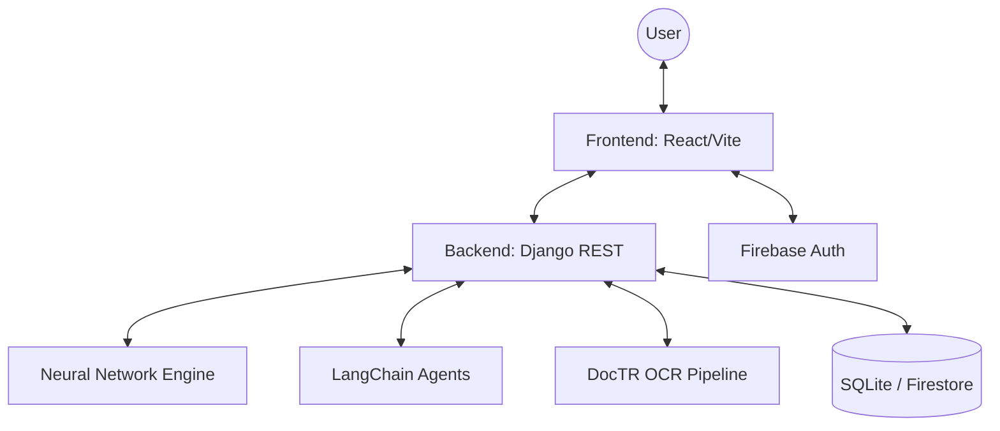

# System Architecture - SymptoSense

## 1. Overview
SymptoSense is an AI-driven healthcare platform that processes clinical symptoms and medical reports to provide personalized medical insights. It employs a hybrid AI strategy:
- **Predictive AI**: A dedicated Neural Network for initial disease screening.
- **Generative AI**: Specialized LangChain agents powered by Gemma 4 for detailed medical exploration.

## 2. High-Level Architecture

## 3. Component Breakdown

### 3.1 Frontend (React + TypeScript)
- **State Management**: React Context for Auth and global state.
- **UI System**: Tailwind CSS with custom glassmorphic components.
- **Routing**: Client-side routing with protected assessment paths.
- **API Client**: Axios-based service layer with token interceptors.

### 3.2 Backend (Django)
- **REST API**: Built with Django REST Framework (DRF).
- **Service Layer**: Decouples API logic from AI orchestration.
- **Integration**: Single point of contact for AI services and data persistence.

### 3.3 AI & Machine Learning Engine
#### A. Disease Prediction (Neural Network)
- Custom-trained model to map symptom vectors to medical conditions.
- Integrated via Python backend for real-time inference.

#### B. Multi-Agent Orchestration (LangChain)
- **Clinical Insights Agent**: Identifies immediate actions.
- **Clinical Guidelines Agent**: Sources evidence-based protocols.
- **Treatment Exploration Agent**: Cross-disciplinary treatment analysis.
- **Lifestyle & Diet Agent**: Preventive and supportive care advice.

#### C. Medical Document Intelligence (OCR)
- Uses **DocTR** for high-precision text extraction from medical PDFs and images.
- Structured data extraction for symptom analysis.

## 4. Data Flow
1. **User Input**: Symptoms selected or report uploaded.
2. **Preprocessing**: OCR extracts text if a report is provided.
3. **Primary Analysis**: Neural Network predicts potential conditions.
4. **Secondary Analysis**: LangChain agents execute parallel queries based on primary analysis.
5. **Consolidation**: Backend merges agent outputs into a unified JSON report.
6. **Delivery**: Frontend renders the interactive medical dashboard.

## 5. Security & Compliance
- **Authentication**: Secured via Firebase Identity Platform.
- **Authorization**: Token-based access to assessment history.
- **Privacy**: Local-first processing with selective cloud storage for history.

---
*Last Updated: April 13, 2026*
